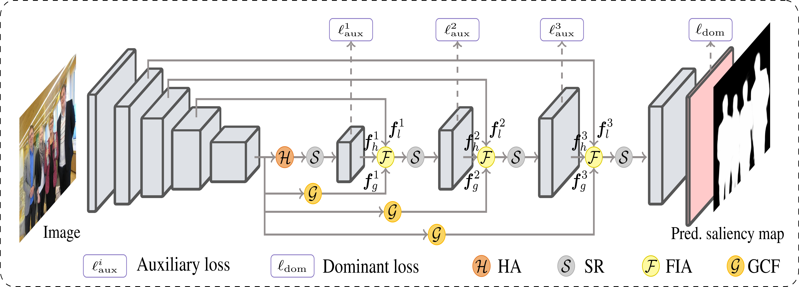

# Global Context-Aware Progressive Aggregation Network for Salient Object Detection

This repo. is an implementation of *GCPANet* , which is accepted for presentation in *AAAI 2020*.




## dependencies 
```
>= Ubuntu 16.04 
>= Python3.5
>= Pytorch 1.0.0
OpenCV-Python
```

## preparation 
- download the official pretrained model ([Google drive](https://drive.google.com/open?id=107fXhddjD4LBEYvMtYqlPmjuZOfhhEnN)) of ResNet-50 implemented in Pytorch if you want to train the network again.
- download or put the RGB saliency benchmark datasets ([Google drive](https://drive.google.com/open?id=1S8jC0c-vYEGV0jX9ZizPH8SPaKQ7zxM1)) in the folder of `data` for training or test.

## training
you may revise the `TAG` and `SAVEPATH` defined in the *train.py*. After the preparation, run this command 
```
python3 train.py
```
make sure  that the GPU memory is enough (the original training is conducted on a NVIDIA RTX (24G) card with the batch size of 32).

## test
After the preparation, run this commond
```
 python3 test.py model/model-xxxxx.pt
```

We provide the trained model file ([Google drive](https://drive.google.com/open?id=1YKkzYzZuCbGs0zVQwRQ-z8_ounUgYb0d)), and run this command to check its completeness:
```
cksum model-100045448.pt 
```
you will obtain the result `100045448 268562671 model_100045448.pt`.
The saliency maps are also available ([Google drive](https://drive.google.com/open?id=19fkcf1F8BUmLwjYqqDMuVcFGhMGCBnzE)). 

## evaluation
We provide the evaluation code in the folder  "eval_code" for fair comparisons. You may need to revise the `algorithms` , `data_root`, and `maps_root` defined in the `main.m`. The saliency maps of the competitors are provided ([Google drive](https://drive.google.com/open?id=1JiIKySc3-IwfoUhNW7qNul9T3pfkqnYu)).
